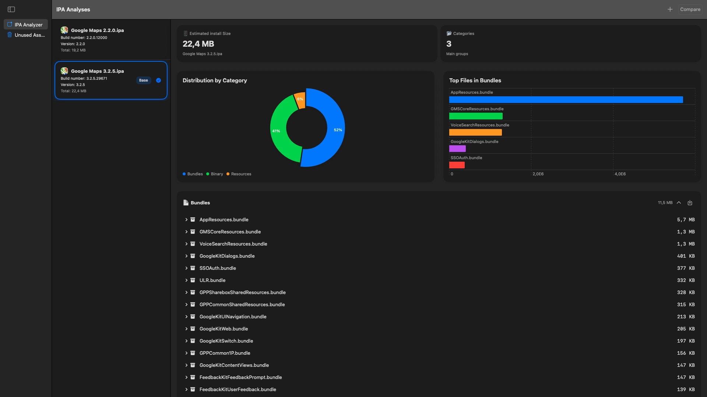
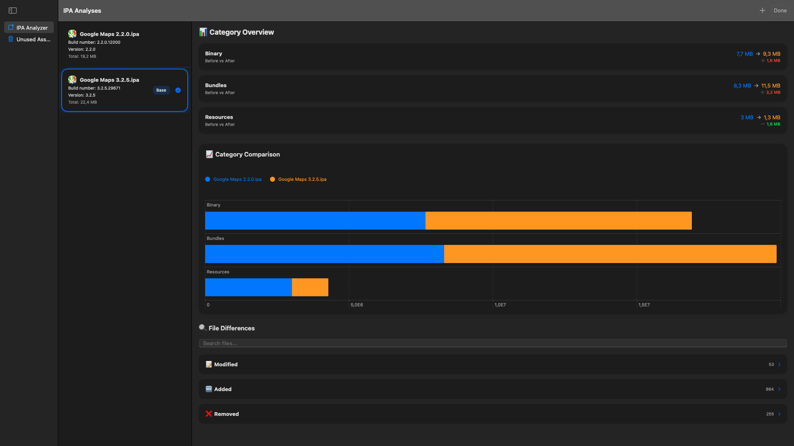
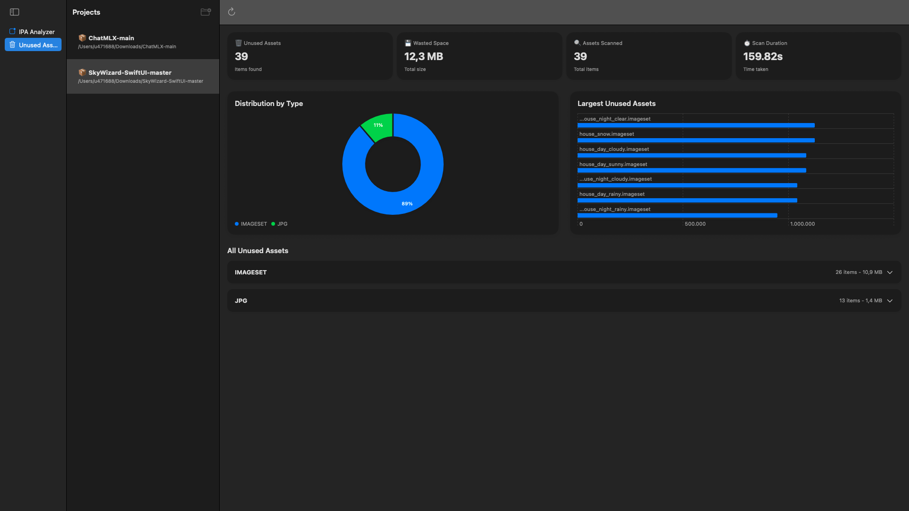

# FRTMTools 🛠️✨

**Your App's Best Friend for Analysis, Comparison, and Optimization.**

FRTMTools is not just a tool; it's your secret weapon. A powerful macOS application forged for developers who want to look under the hood of their `.ipa` files. Get mind-blowing insights into your app's DNA, track down every byte, and discover optimization opportunities with an interface so beautiful, you'll want to leave it open all day.

## ✨ Key Features

### 📊 Deep IPA Analysis
*Get a ridiculously detailed overview of your app's structure: binary, resources, frameworks, and more.*

### ↔️ The Ultimate IPA Diff Tool
*Analyze two app versions side-by-side. Know exactly what changed in file size and composition between builds.*

### 🗑️ Unused Assets Hunter
*Find forgotten assets bloating your app. This feature scans your project to identify and help you remove unused resources.*

## 🔥 More Features

*   **📈 Visual Size Distribution:** See where the bytes are hiding with an interactive chart.
*   **🔝 Top File Spotter:** Immediately see the largest files within your frameworks.
*   **🌳 File Tree Explorer:** Navigate the entire contents of your unpacked `.ipa`.
*   **🎨 A Work of Art UI:** A sleek, modern interface built with SwiftUI.

## 🚀 Get Started in a Flash

1.  **Download** the latest masterpiece from the Releases page.
2.  **Unleash** the application.
3.  **Drag and drop** an `.ipa` file onto the window. Prepare to be amazed.

## 💻 The Magic Inside

*   **Swift & SwiftUI:** Forged with modern Apple technologies for a buttery-smooth experience on macOS.
*   **Combine:** For a reactive and declarative data flow that just works.

## 👥 Contributors

A huge thank you to all the amazing people who contributed to this project:  

- [@Davide Fiorino](https://github.com/DaveFiorino) 🚀

---

## 🙏 Join the Revolution

Got ideas? Found a bug? Contributions are what make the world go 'round. Feel free to open an issue or submit a pull request.

---

*Crafted with ❤️ and a lot of ☕ for the iOS developer community.*
