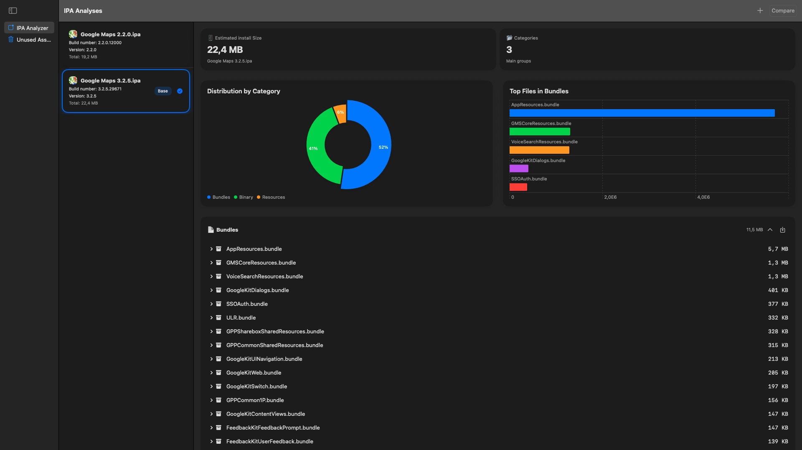
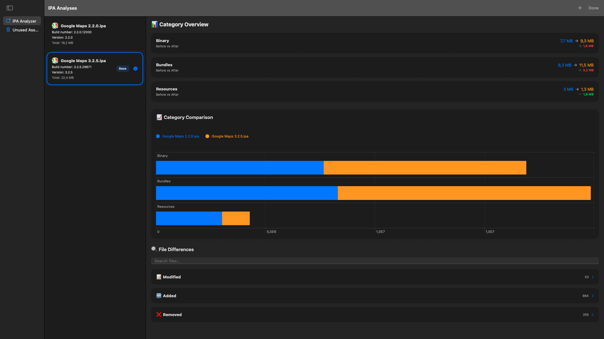
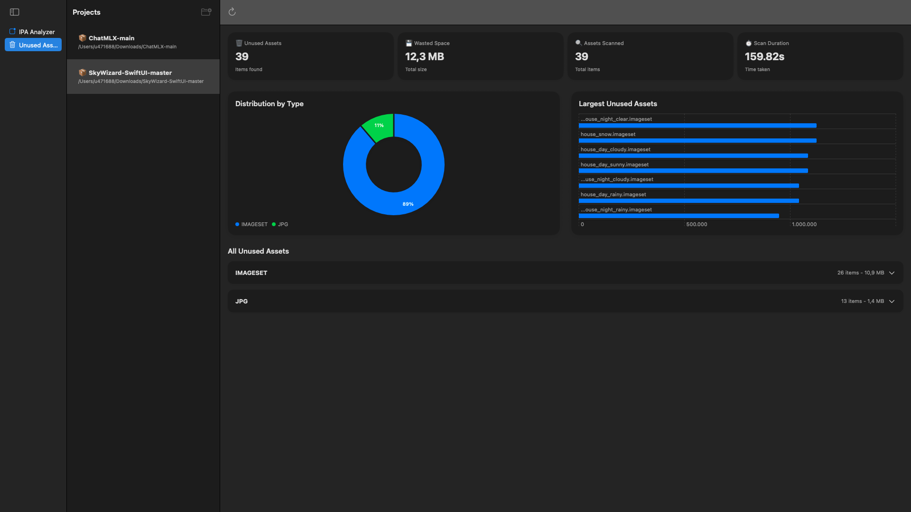

# FRTMTools

A desktop + CLI toolkit for dissecting mobile application bundles. Feed it an IPA, APK,
or AAB and you’ll get instant visibility into binaries, resources, dependencies, and
security posture—with actionable tips on how to slim everything down.

## Highlights

- **Cross-platform bundle analysis** – A single scan surfaces IPA internals (Mach-O
  binaries, frameworks, bundles) and Android specifics (Dex vs native libs, manifest
  components, permissions).
- **Binary stripping insights** – Every Mach-O discovered during the scan is checked for
  debug symbols. Unstripped binaries are listed with per-file savings in both the app and
  the generated HTML dashboards.
- **Side-by-side comparisons** – Compare two builds to understand size deltas per file
  or category before publishing.
- **Optimization tips** – The `TipGenerator` catches duplicate assets, oversized
  resources, ATS exceptions, dangerous permissions, and more.
- **Beautiful SwiftUI dashboards** – Interactive charts, dependency graphs, manifest
  insights, and summary cards for both iOS and Android packages.
- **Full-featured CLI** – Automate scans inside CI using the same analyzer core as the
  macOS app. JSON + HTML outputs make it easy to share reports.

## Screenshots

| IPA Analysis | Compare View | Asset Hunter |
| --- | --- | --- |
|  |  |  |

## Repository Layout

```
Sources/Analyzers/AppAnalyzer/
├─ Core/            # Analyzer engines (IPA/APK/shared)
├─ Components/      # SwiftUI building blocks (Shared, IPA, APK)
├─ Screens/         # Feature-level views grouped by platform
├─ ViewModels/      # Shared + platform-specific view models
├─ Support/         # Protocols/utilities shared by the UI
└─ SubAnalyzer/     # Lower-level analyzers (BinaryAnalyzer, etc.)
```

## Documentation

- [Analyzer details](Docs/Analyzers.md)
- [CLI usage](Docs/CLI.md)

## Installing the CLI

```bash
brew tap valentinopalomba/frtmtools
brew install frtmtools
```

Run `frtmtools --help` for the command list or see [Docs/CLI.md](Docs/CLI.md) for more
options.

## Development Notes

- **Language stack** – Swift + SwiftUI, Combine, and a few helper frameworks (Periphery,
  ForceSimulation, etc.).
- **Project organization** – Shared SwiftUI components live under `Components/`, while
  platform-specific screens and view models stay in `Screens/IPA`, `Screens/APK`, and
  `ViewModels/IPA`, `ViewModels/APK` respectively.
- **Tips engine** – `TipGenerator` consumes the analyzer output to produce both UI
  warnings and CLI messages. Any new analyzer signal should be exposed through this class
  so it automatically flows everywhere.

## Contributing

We welcome pull requests! Open an issue if you spot a bug or want to propose a feature.
Keep PRs focused, include tests or sample reports when relevant, and follow the existing
Swift style.

## Support the Project

[](https://www.buymeacoffee.com/fratm)

Crafted with ❤️ for the iOS & Android developer community.
