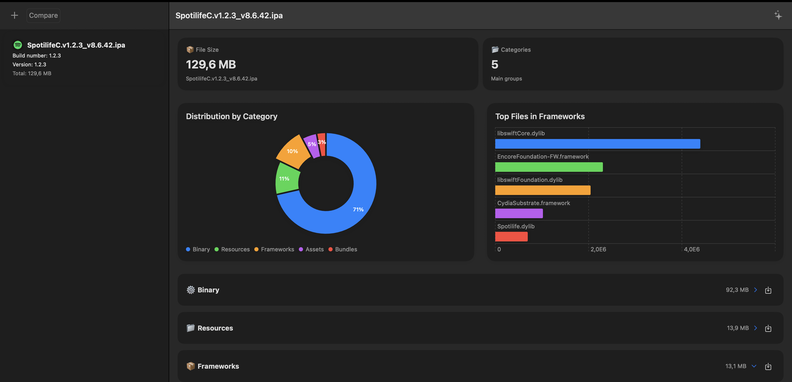

# FRTMTools 🛠️

**Analyze, Compare, and Optimize your iOS Apps.**

FRTMTools is a powerful macOS application designed for developers to dive deep into the contents of their `.ipa` files. Gain insights into your app's composition, track size changes over time, and identify optimization opportunities with an intuitive and beautiful interface.

## ✨ Features

*   **📊 Detailed IPA Analysis:** Get a comprehensive overview of your app's structure. See a breakdown of your binary, resources, frameworks, assets, and bundles.
*   **📈 Size Distribution:** Visualize the composition of your app with an interactive chart. Quickly identify which categories are contributing the most to your app's total size.
*   **🔝 Top File Insights:** Instantly see the largest files within your frameworks, helping you pinpoint potential areas for size reduction.
*   **↔️ IPA Comparison:** Analyze two different versions of your app side-by-side. Understand exactly what's changed in terms of file size and composition between builds.
*   **🌳 File Tree Explorer:** Navigate the entire contents of your unpacked `.ipa` in a familiar tree-like structure.
*   **🤖 AI-Powered Tips (Coming Soon!):** Leverage AI to get actionable tips and suggestions for optimizing your app's performance and size.
*   **🎨 Modern UI:** A sleek, modern interface built with SwiftUI.

## 🚀 Getting Started

1.  **Download** the latest release from the Releases page.
2.  **Open** the application.
3.  **Drag and drop** an `.ipa` file onto the window to start the analysis.

## 💻 Technologies

*   **Swift & SwiftUI:** Built entirely with modern Apple technologies for a native and fluid experience on macOS.
*   **Combine:** For reactive and declarative data flow.

## 🙏 Contributing

Contributions are welcome! If you have ideas for new features or improvements, feel free to open an issue or submit a pull request.

---

*Made with ❤️ for the iOS developer community.*